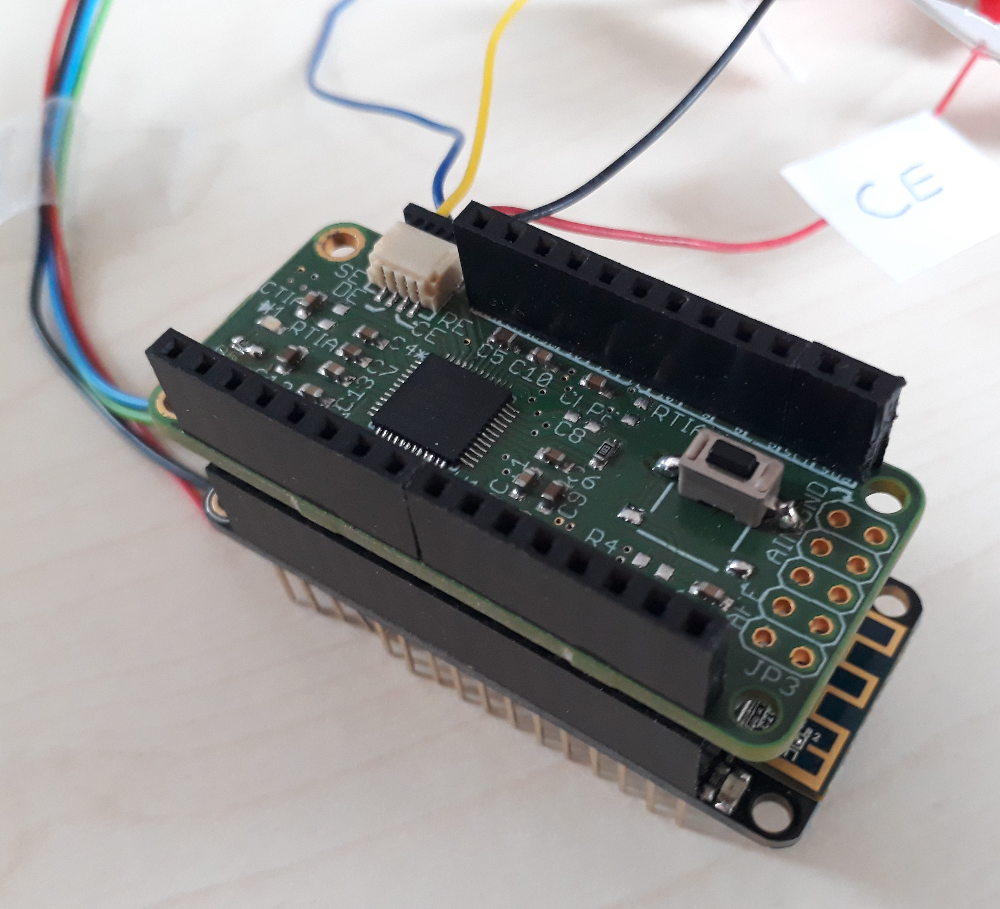

# FreiStat - AD5941 Potentiostat
Contributors: David Bill (major), Jochen Kieninger (minor)

Contact: Dr. Jochen Kieninger, kieninger@imtek.uni-freiburg.de

[Laboratory for Sensors](https://www.imtek.de/laboratories/sensors/sensors_home?set_language=en), IMTEK, University of Freiburg



## About
This repo contains code to run electrochemical measurements with the Analog Devices AD5940 or AD5941 integrated potentiostat controlled by an Adafruit Feather M0 Wifi (MCU). It was created as part of a master thesis.

The code is based on the example code from Analog Devices. It compiles with the Arduino IDE and can be used with other compatible MCUs.

## Hardware
The following hardware was used:
* Adafruit Feather M0 Wifi
* "AD5941 FeatherWing"-PCB with the following interface to the Adafruit M0 Wifi MCU:
    - SPI (CS line connected to A5)
    - AD5941 Reset connected to A4
    - AD5941 GPIO0 (used as interrupt pin) connected to A1
    - AD5941 GPIO1 connected to A2
    - AD5941 GPIO2 connected to A3


Code is compatible with the AD5940!

## Library Requirements
### AD5940/AD5941 library
* Download the library files (ad5940.c and ad5940.h) from https://github.com/analogdevicesinc/ad5940lib
* Place the files into the project folder or create a folder "ad5940" in your local Arduino libraries directory
* Make sure that c++ compiler is supported. The ad5940.h file should contain the following:
```c++
#ifdef __cplusplus
extern "C" {
#endif
< content of .h file >
#ifdef __cplusplus
}
#endif
```
* Select the AD5940/AD5941 chip by uncommenting the following line in the ad5940.h file:
```c++
#define CHIPSEL_594X      /**< AD5940 or AD5941 */
 ```
* If you want to see debug info from the .c files (e.g. RampTest.c) uncomment the following line in the ad5940.h file:
```c++
#define ADI_DEBUG   /**< Comment this line to remove debug info. */
```

### LibPrintf
* Download the Arduino Printf library from https://github.com/embeddedartistry/arduino-printf to add support for the `printf()` function

### ArduinoPort.cpp
This file is the bridge between the Adafruit/Arduino MCU and the AD5940/AD5941 library. It provides all functions (SPI communication and interrupts)
to make the library work.
* Place the file into the project folder or create a folder "ad5940" in your local Arduino libraries directory

## Voltammetry Firmware
This firmware allows to perform cyclic voltammetry or linear sweep voltammetry with the current averaging method. After each step the processed average values are sent to the serial port together with the applied voltage step.
The CV_plotter.py script can be used to plot the values during the measurement (ensure that in firmware the `DEBUG` and `ADI_DEBUG` makros are commented out).

Configure the measurement (voltammetric method, ramp parameters, sampling frequency, potentiostat settings) with the `AD5940RampStructInit()` function.

Specifications:
* Excitation (cell) voltage range: +/- 1100mV (can be extended to +/- 2200mV with the `FIX_WE_POT` makro in RampTest.h)
* Minimum potential step (Estep): 537 µV
* Do not use scan rates higher than 100 mV/s with Estep <= 1 mV

## Chronoamperometry Firmware
This firmware allows to perform chrononamperometry. After a predefined number of current samples is averaged (necessary to reduce data output rate for USB communication), the result is sent to the serial port.
The CA_plotter.py script can be used to plot the values during the measurement (ensure that in firmware the `DEBUG` and `ADI_DEBUG` makros are commented out).

Configure the measurement (CA parameters, sampling frequency, potentiostat settings) with the `AD5940AMPStructInit()` function.


## How to use the code
* To use the python scripts for plotting and storing data in .csv files, ensure that no debug infos are output by commenting the following lines:
1) ad5940.h file:
```c++
//#define ADI_DEBUG   /**< Comment this line to remove debug info. */
```
2) .ino file:
```c++
//#define DEBUG
```
* Compile and upload the (configured) code using the Arduino IDE or other compatible IDEs (e.g. Visual Studio Code with Arduino extension)
* Set the correct COM port in the python script
* Connect the Adafruit/Arduino via USB
* Run the python script
